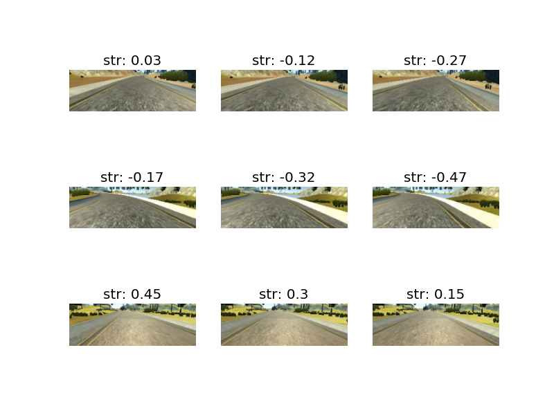

# Use Deep Learning to Clone Driving Behavior
This project presents an end-to-end deep learning approach to predict the steering angle of a self-driving car in a simulator environment. 
A CNN (Convolutional Neural Network) was implemented and trained using Keras and Tensorflow.
This project was developed and submitted as part of Udacity Self Driving Car Nanodegree. 

## Network Architecture
The used network architecture is similar to the proposed Nvidia model: 
<http://images.nvidia.com/content/tegra/automotive/images/2016/solutions/pdf/end-to-end-dl-using-px.pdf>
A short summary is given here:

```
Layer (type)                     Output Shape          Param #     Connected to                     
====================================================================================================
lambda_1 (Lambda)                (None, 66, 200, 3)    0           lambda_input_1[0][0]             
____________________________________________________________________________________________________
convolution2d_1 (Convolution2D)  (None, 33, 100, 24)   1824        lambda_1[0][0]                   
____________________________________________________________________________________________________
activation_1 (Activation)        (None, 33, 100, 24)   0           convolution2d_1[0][0]            
____________________________________________________________________________________________________
convolution2d_2 (Convolution2D)  (None, 17, 50, 36)    21636       activation_1[0][0]               
____________________________________________________________________________________________________
activation_2 (Activation)        (None, 17, 50, 36)    0           convolution2d_2[0][0]            
____________________________________________________________________________________________________
convolution2d_3 (Convolution2D)  (None, 9, 25, 48)     43248       activation_2[0][0]               
____________________________________________________________________________________________________
activation_3 (Activation)        (None, 9, 25, 48)     0           convolution2d_3[0][0]            
____________________________________________________________________________________________________
convolution2d_4 (Convolution2D)  (None, 5, 13, 64)     27712       activation_3[0][0]               
____________________________________________________________________________________________________
activation_4 (Activation)        (None, 5, 13, 64)     0           convolution2d_4[0][0]            
____________________________________________________________________________________________________
convolution2d_5 (Convolution2D)  (None, 3, 7, 64)      36928       activation_4[0][0]               
____________________________________________________________________________________________________
flatten_1 (Flatten)              (None, 1344)          0           convolution2d_5[0][0]            
____________________________________________________________________________________________________
activation_5 (Activation)        (None, 1344)          0           flatten_1[0][0]                  
____________________________________________________________________________________________________
dense_1 (Dense)                  (None, 100)           134500      activation_5[0][0]               
____________________________________________________________________________________________________
activation_6 (Activation)        (None, 100)           0           dense_1[0][0]                    
____________________________________________________________________________________________________
dense_2 (Dense)                  (None, 50)            5050        activation_6[0][0]               
____________________________________________________________________________________________________
activation_7 (Activation)        (None, 50)            0           dense_2[0][0]                    
____________________________________________________________________________________________________
dense_3 (Dense)                  (None, 10)            510         activation_7[0][0]               
____________________________________________________________________________________________________
activation_8 (Activation)        (None, 10)            0           dense_3[0][0]                    
____________________________________________________________________________________________________
dense_4 (Dense)                  (None, 1)             11          activation_8[0][0]               
====================================================================================================
Total params: 271419
```
The network contains 5 convolutional layers, each layer has a stride of 2 in each direction. 
Dropout or L2-Regularization that should help to reduce overfitting were not used in this model since 
they did not improve the model, the driving behaviour was definetly worse.
With about 270k parameters, the model is relatively small. 
This might be a reason why regularization is not that important for this model.
Besides that I have tried other network architectures like the Comma model
<https://github.com/commaai/research/blob/master/train_steering_model.py> or an VGG-like network network topology
<https://keras.io/getting-started/sequential-model-guide/> but they yielded inferior results.

## Data Preprocessing
For training the official Udacity dataset <https://d17h27t6h515a5.cloudfront.net/topher/2016/December/584f6edd_data/data.zip> was used. It contains 8036 image triplets consisting of a center image, a left image and a right image.
I also used a bigger own dataset with about 80k image triplets but it did not result in a clear improvement and just prolonged the training, so I decided to focus on the Udacity dataset.
The left and right images were used for recovery training to learn what to do if the car gets off to the side of the road.
The steering angle for the left and right views was modified so that there is always a restoring force back to the center of the road, see this figure for an example:


## Training Approach

## Data
