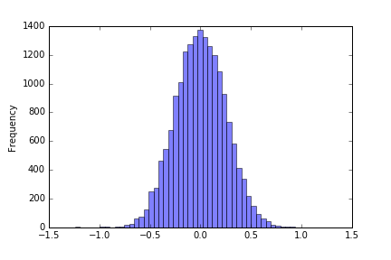

# Use Deep Learning to Clone Driving Behavior
This project presents an end-to-end deep learning approach to predict the steering angle of a self-driving car in a simulator environment. 
A CNN (Convolutional Neural Network) was implemented and trained using Keras and Tensorflow.
This project was developed and submitted as part of Udacity Self Driving Car Nanodegree. 

## Network Architecture
The used network architecture is similar to the proposed Nvidia model: 
<http://images.nvidia.com/content/tegra/automotive/images/2016/solutions/pdf/end-to-end-dl-using-px.pdf>
A short summary is given here:

```
Layer (type)                     Output Shape          Param #     Connected to                     
====================================================================================================
lambda_1 (Lambda)                (None, 66, 200, 3)    0           lambda_input_1[0][0]             
____________________________________________________________________________________________________
convolution2d_1 (Convolution2D)  (None, 33, 100, 24)   1824        lambda_1[0][0]                   
____________________________________________________________________________________________________
activation_1 (Activation)        (None, 33, 100, 24)   0           convolution2d_1[0][0]            
____________________________________________________________________________________________________
convolution2d_2 (Convolution2D)  (None, 17, 50, 36)    21636       activation_1[0][0]               
____________________________________________________________________________________________________
activation_2 (Activation)        (None, 17, 50, 36)    0           convolution2d_2[0][0]            
____________________________________________________________________________________________________
convolution2d_3 (Convolution2D)  (None, 9, 25, 48)     43248       activation_2[0][0]               
____________________________________________________________________________________________________
activation_3 (Activation)        (None, 9, 25, 48)     0           convolution2d_3[0][0]            
____________________________________________________________________________________________________
convolution2d_4 (Convolution2D)  (None, 5, 13, 64)     27712       activation_3[0][0]               
____________________________________________________________________________________________________
activation_4 (Activation)        (None, 5, 13, 64)     0           convolution2d_4[0][0]            
____________________________________________________________________________________________________
convolution2d_5 (Convolution2D)  (None, 3, 7, 64)      36928       activation_4[0][0]               
____________________________________________________________________________________________________
flatten_1 (Flatten)              (None, 1344)          0           convolution2d_5[0][0]            
____________________________________________________________________________________________________
activation_5 (Activation)        (None, 1344)          0           flatten_1[0][0]                  
____________________________________________________________________________________________________
dense_1 (Dense)                  (None, 100)           134500      activation_5[0][0]               
____________________________________________________________________________________________________
activation_6 (Activation)        (None, 100)           0           dense_1[0][0]                    
____________________________________________________________________________________________________
dense_2 (Dense)                  (None, 50)            5050        activation_6[0][0]               
____________________________________________________________________________________________________
activation_7 (Activation)        (None, 50)            0           dense_2[0][0]                    
____________________________________________________________________________________________________
dense_3 (Dense)                  (None, 10)            510         activation_7[0][0]               
____________________________________________________________________________________________________
activation_8 (Activation)        (None, 10)            0           dense_3[0][0]                    
____________________________________________________________________________________________________
dense_4 (Dense)                  (None, 1)             11          activation_8[0][0]               
====================================================================================================
Total params: 271419
```
The network contains 5 convolutional layers, each layer has a stride of 2 in each direction. 
Dropout or L2-Regularization that should help to reduce overfitting were not used in this model since 
they did not improve the model, the driving behaviour was definetly worse.
With about 270k parameters, the model is relatively small. 
This might be a reason why regularization is not that important for this model.
Besides that I have tried other network architectures like the Comma model
<https://github.com/commaai/research/blob/master/train_steering_model.py> or an VGG-like network network topology
<https://keras.io/getting-started/sequential-model-guide/> but they yielded inferior results.

## Data 
The official Udacity training data set <https://d17h27t6h515a5.cloudfront.net/topher/2016/December/584f6edd_data/data.zip> has been used for this project. Adding significantly more training data (~80k images) did not yield a clear improvement and just prolonged the training process, so I decided to focus on the Udacity dataset.
The dataset contains 8036 image triplets of size (320x160) with a center camera image, a left and a right camera image. Training data was first cropped to remove some non-relevant image areas, normalized to the range -0.5 to 0.5 and resized to Nvidia image format (200x66). Subsequently training data was split into a training (80%) and validation (20%) part. For the objective function to minimize the mean squared error of the predictions was chosen. However, the model with the best mean squared error does not necessarily needs to be the best model on the track, so typically one has to test multiple models. Due to that, a specific test data set was not selected.

## Data Preprocessing
The first track mostly contains left curves, so that the training data will be biased towards negative steering angles. Besides that, the zero steering angle when just driving straight is overrepresented. Due to that, I decided to remove a big part of this overrepresented data. For recovery I tried both to collect manual recovery scenes and using the left and right images for recovery. In the end, the approach using left and right camera images performed better, otherwise the training process would need multiple training and data collection iterations.
For the left and right camera images the groundtruth steering angle needs to be adapted to teach to model always driving back to the center of the track, see these figures:

In order to remove the bias towards negative steering angles the input dataset has been mirrored along the center vertical image axis. 
The following figure shows the final distribution of the training dataset:

In order to make the driving smoother, I decided to randomly shift the input images horizontally. This horizontal shift also requires an adaption of the steering angle pointing back to the center of the track. The idea of shifting is to have a restoring force back to the center even before it touches the border markings. 

## Training Approach
For training, the mean squared prediction error was minimized using Adam's optimizer which is a good choice at the moment (see <http://sebastianruder.com/optimizing-gradient-descent/> for a comparison). Validation error was monitored to prevent overfitting and as a guide to select the right model for testing on the track. In order to do early stopping, a larger patience value should be used because the validation error sometimes is not decreasing monotonously.


### Conclusion
This was really an amazing project! It was a great feeling when the car was driving successfully on the track for the first time. At first due to some bugs in my code I really had issues producing any useful results. Due to that, I tried a lot of different network architectures and different kinds of data augmentation which helped to get a deeper insight in this project. So the results presented here can just reflect a very small part of the experiences that I made when I was working on this project. As usual, the discussions on the forum or via Slack channel helped a lot. Besides that, of course the approaches from the Udacity challenge <https://github.com/udacity/self-driving-car/tree/master/steering-models/community-models> also were interesting to see. I hope that I can further improve the driving behavior in the future using filtering techniques or using different network types.
